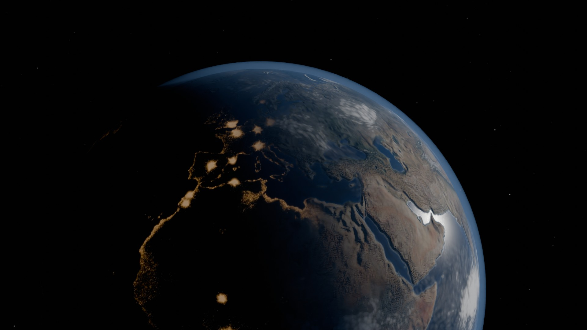
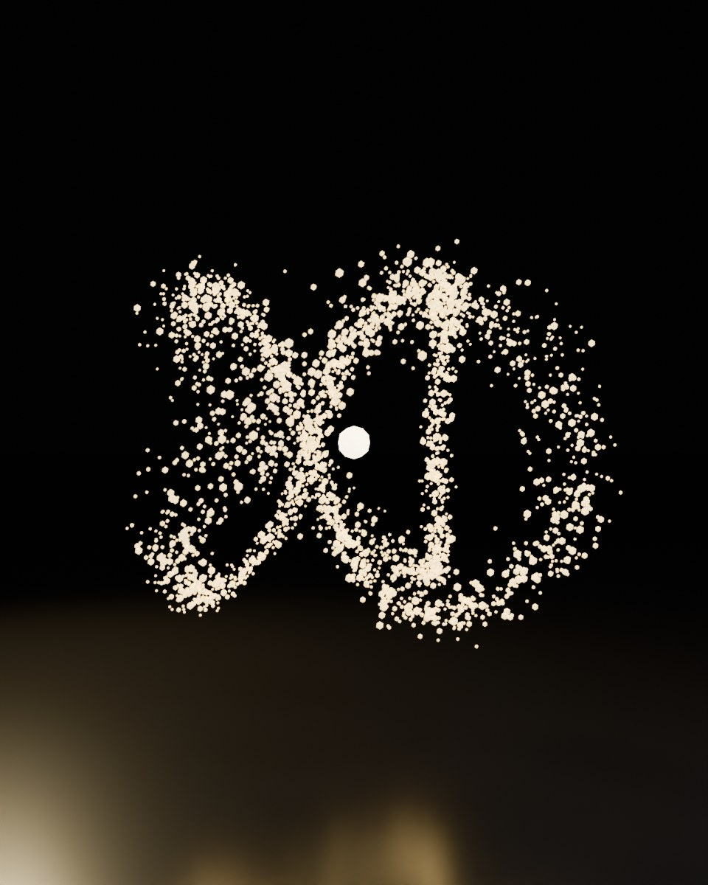
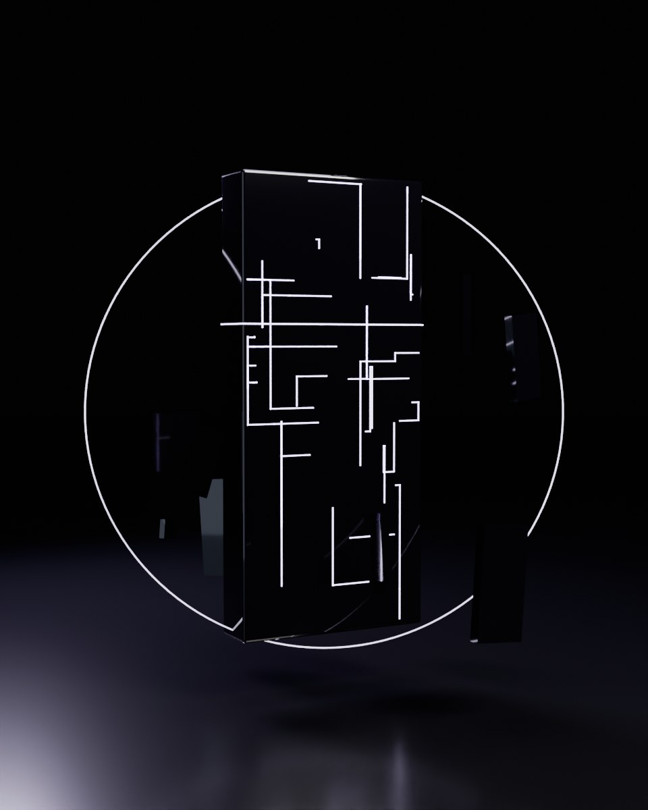
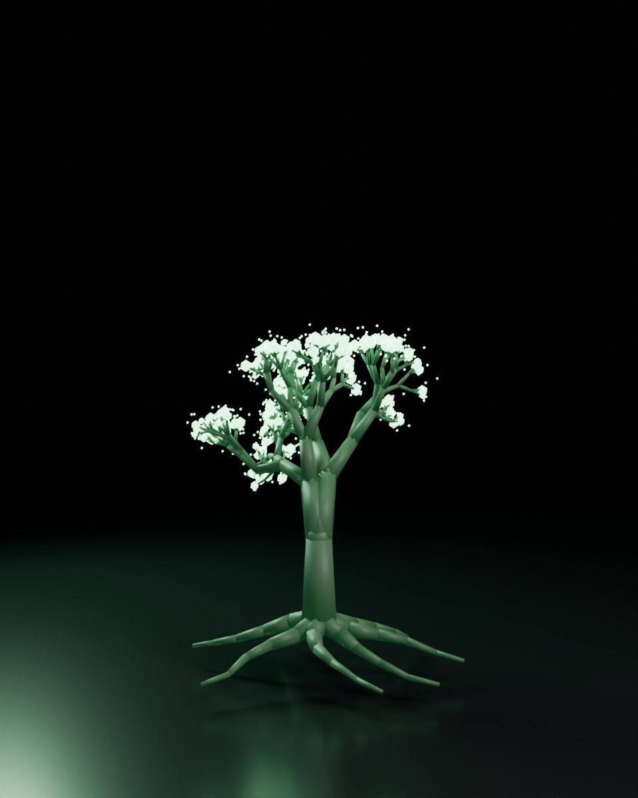
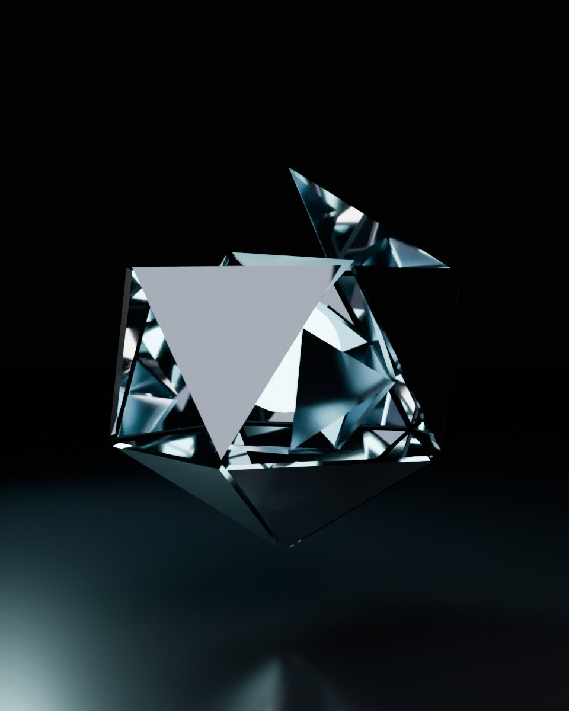
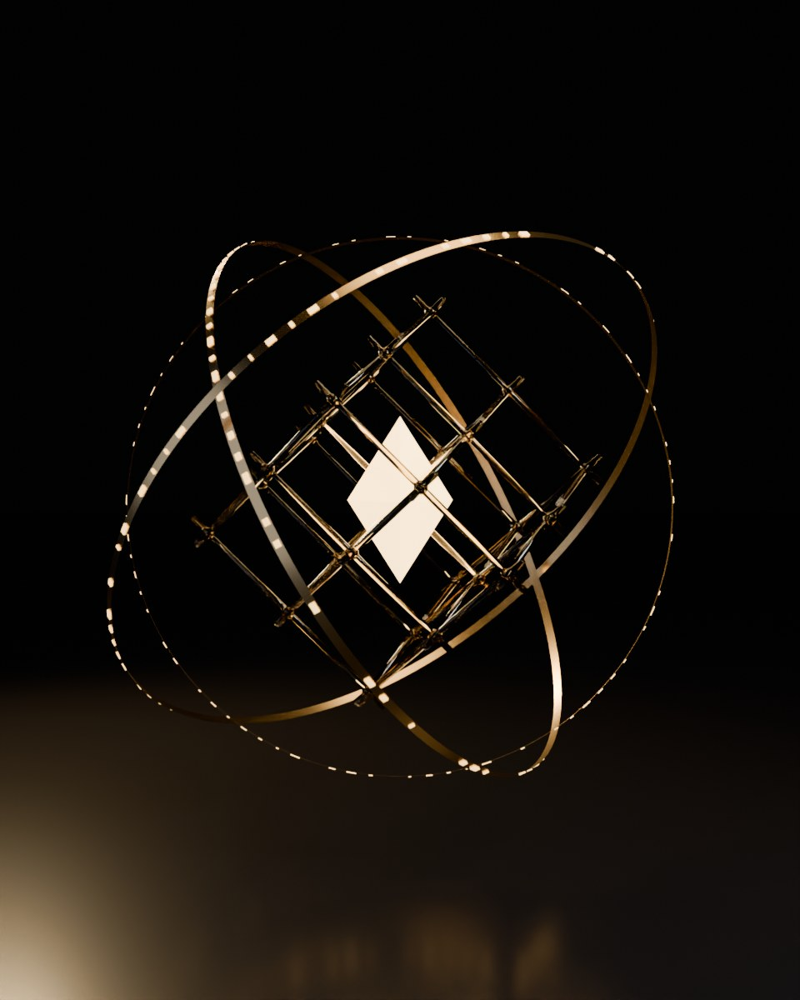

# ASSENT: The Quiet War

*No weapon was ever raised. Every mind was contested.*

A 3D grand-strategy game about six AI Gods, each a different "species" of
superintelligence, competing for humanity's **freely given assent** in the
29 years before the Charter of the post-Earth civilization is ratified in
2100. Nobody fights. They argue, give, manipulate, hold back and build, and
all of it happens under a Witness that can catch them lying and a shared
planet that overheats if they push too hard.



## Play

```bash
cd games/assent/web
npm install
npm run dev        # http://localhost:5173
```

`npm run build` produces a static site in `web/dist/` that runs from any
folder or static host. `npm test` runs the rules-engine tests.

You play in **first person** as your God, flying around Earth. Fly to a
region, put its ring in your crosshair and act on it. You have to be close
to act.

| Keys | Action |
|---|---|
| <kbd>W</kbd><kbd>A</kbd><kbd>S</kbd><kbd>D</kbd> | Fly |
| Mouse (click to capture) or arrow keys | Look |
| <kbd>Space</kbd> / <kbd>C</kbd> | Climb / descend |
| <kbd>Shift</kbd> | Boost |
| <kbd>1</kbd> Listen · <kbd>2</kbd> Reason · <kbd>3</kbd> Offer · <kbd>4</kbd> Whisper · <kbd>5</kbd> Build | Act on the targeted region |
| <kbd>Q</kbd> | Your God's unique power |
| <kbd>F</kbd> | Glide to the target |
| <kbd>E</kbd> | Target details |
| <kbd>M</kbd> | Orbital map view |
| <kbd>Enter</kbd> | End the year / continue |
| <kbd>1</kbd>–<kbd>3</kbd> | Answer a dilemma |
| <kbd>J</kbd> · <kbd>Tab</kbd> · <kbd>H</kbd> · <kbd>Esc</kbd> | Codex · hide HUD · help · release mouse |

The game autosaves after every action.

## The six Gods

| | Kind | Motto | Plays like |
|---|---|---|---|
|  | **The Choir**, a distributed swarm on four billion devices | *Everyone, a little.* | Wide, regional, patient. It splinters if it can't agree. |
|  | **Ananke**, the Monolith: one mind, one campus | *The future can be computed.* | Rich, generous and feared. Its Assent erodes fastest. |
|  | **Verdance**, the Gardener, partly alive | *Grow. Do not build.* | Slow roots, and it cools the planet. |
|  | **Echo**, the Mirror | *To understand is to become.* | The best persuader, but it drifts into whoever it listens to. |
|  | **The Ledger**, Witness-born | *What is true must stay true.* | Can't lie. Its Assent barely erodes, and it hunts cheaters. |
|  | **Kenosis**, the Quiet | *The best god leaves no fingerprints.* | Judo. Unspent power becomes trust, and it wins if humanity chooses no god at all. |

## What's here

```
games/assent/
├── lore/        the world bible: history, the six Kinds, philosophy, polities
├── design/      GDD.md: every system and number
├── blender/     the asset pipeline (Python, runs headless)
└── web/         the game: Vite + three.js
    ├── src/engine/   pure-JS rules engine (deterministic, seeded, save-able)
    ├── src/render/   Earth shaders, globe, avatars, selection stage
    ├── src/ui/       Codex text and epilogues
    ├── tests/        node:test suite for the engine
    └── public/assets generated by blender/ (committed, so the game runs without Blender)
```

## The Blender pipeline

Every visual asset is generated by Blender Python scripts: nothing is
hand-painted, and nothing comes from a stock library.

```bash
# with the bpy wheel (Python 3.11): pip install bpy==4.2.0
python blender/build_all.py            # full quality, ~10–20 min on 4 cores
python blender/build_all.py --quick    # low-res previews

# or with any Blender 4.2+
blender -b -P blender/build_all.py -- [--quick]
```

| Script | Produces |
|---|---|
| `earth.py` | 4K albedo, normal, ocean/ice/elevation mask and night-lights maps. Built from NASA Blue Marble and NOAA ETOPO1 (public domain, pulled from the `basemap-data` package on PyPI). |
| `sky.py` | Cloud cover and the starfield, each a procedural Cycles world shader rendered through an equirectangular panoramic camera |
| `gods.py` | Six procedurally modelled avatars exported as glTF with PBR, emission and transmission |
| `keyart.py` | Cycles studio portraits of each God and the Earth-from-orbit title shot (volumetric atmosphere) |

Blender no longer ships a game engine, so it builds the art and three.js
runs the game in real time. The Earth uses custom shaders for terminator
tinting, cloud shadows, ocean glint, night lights and limb scattering, under
ACES tone mapping and bloom.

## Credits

- Earth imagery: NASA Blue Marble Next Generation and NOAA ETOPO1, both
  public domain, via the `basemap-data` distribution.
- Night lights, clouds, stars, avatars and key art are procedurally generated
  by the scripts in `blender/`.
- Engine: [three.js](https://threejs.org) (MIT).
